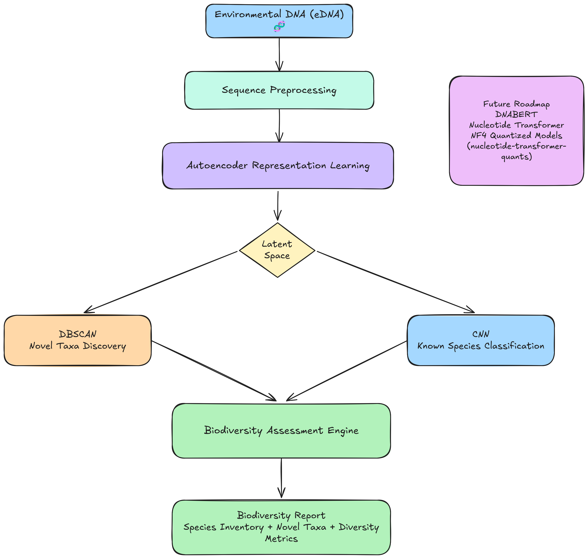

# Sea-quenced 🌊

## AI-Powered eDNA Biodiversity Analysis and Novel Taxa Discovery

### Project Overview

The deep ocean contains one of the largest reservoirs of undiscovered biodiversity on Earth. Traditional biodiversity assessment methods rely heavily on reference databases and sequence alignment techniques, limiting their ability to identify previously uncharacterized organisms.

Sea-quenced is an AI-driven bioinformatics pipeline designed to analyze environmental DNA (eDNA) datasets and perform comprehensive biodiversity assessment through a combination of supervised and unsupervised machine learning techniques.

Unlike conventional taxonomic workflows, Sea-quenced not only classifies known organisms but also identifies potentially novel taxa through latent-space representation learning and density-based clustering, enabling deeper exploration of underrepresented marine ecosystems.

---

## Core Innovation

### Hybrid Learning Architecture

Sea-quenced combines deep learning and unsupervised learning into a unified biodiversity analysis workflow.

Rather than relying solely on reference-based classification, the pipeline leverages multiple specialized machine learning models that operate sequentially to provide both species identification and novel taxa discovery.

This hybrid architecture enables:

* Taxonomic classification of known organisms
* Discovery of previously unseen sequence groups
* Biodiversity characterization at scale
* Reduced dependence on curated reference databases

---

## Pipeline Architecture

### Stage 1 — Latent Representation Learning

An Autoencoder is used to transform high-dimensional DNA sequence data into compact latent representations.

The encoder learns biologically relevant features while reducing dimensionality, producing a latent space that captures meaningful relationships between sequences.

Key benefits include:

* Feature extraction
* Noise reduction
* Dimensionality reduction
* Improved clustering performance

---

### Stage 2 — Novel Taxa Discovery (Autoencoder + DBSCAN)

The latent representations generated by the Autoencoder are analyzed using Density-Based Spatial Clustering of Applications with Noise (DBSCAN).

This stage represents the primary research contribution of the project.

By clustering sequences in latent space rather than relying on predefined labels, Sea-quenced can:

* Detect previously unseen sequence groups
* Identify biologically distinct clusters
* Discover candidate novel taxa
* Recognize outlier organisms

Unlike traditional taxonomic pipelines, this workflow is not restricted to species already present in reference databases.

---

### Stage 3 — Taxonomic Classification (CNN)

For organisms represented in labeled training data, a Convolutional Neural Network (CNN) performs supervised taxonomic classification.

The CNN learns sequence-level patterns and assigns:

* Species labels
* Confidence scores
* Classification metadata

This enables accurate identification of known taxa while complementing the unsupervised discovery workflow.

---

### Stage 4 — Biodiversity Reporting

Outputs from both supervised and unsupervised stages are integrated into a unified biodiversity report.

Generated analyses include:

* Known species inventory
* Novel taxa clusters
* Relative abundance estimates
* Community composition summaries
* Diversity metrics
* Hierarchical relationship visualizations

This provides a comprehensive overview of ecosystem biodiversity from a single eDNA sample.

---

## Technical Stack

### Machine Learning

* PyTorch
* Scikit-learn
* NumPy
* Pandas

### Deep Learning Models

* Autoencoder
* Convolutional Neural Network (CNN)

### Unsupervised Learning

* DBSCAN
* Latent-Space Clustering

### Bioinformatics

* eDNA Processing
* Sequence Representation Learning
* Taxonomic Classification
* Biodiversity Analytics

---

## Future Roadmap

### Real-World Dataset Integration

The current implementation utilizes synthetic genomic datasets for rapid experimentation and validation.

Future versions will support direct integration with real-world sequencing repositories, including:

* NCBI Sequence Read Archive (SRA)
* Public eDNA datasets
* Marine biodiversity sequencing projects

---

### Genomic Foundation Models

Future iterations of Sea-quenced will investigate replacing the current latent-space generation pipeline with transformer-based genomic foundation models, including:

* DNABERT
* Nucleotide Transformer
* Large-scale biological language models

These models have the potential to learn richer biological representations and improve both classification accuracy and novel taxa discovery performance.

---

### Efficient Foundation Model Deployment

As part of this roadmap, a companion project explores efficient deployment of genomic foundation models through NF4 quantization.

Related work:

**Nucleotide Transformer Quantization Repository**
https://github.com/Divyesh-Kamalanaban/nucleotide-transformer-quants

**Quantized Nucleotide Transformer Model**
https://huggingface.co/divyeshkamalanaban/nucleotide-transformer-2.5b-multi-species-NF4-Q4

This work establishes a pathway for integrating large genomic transformers into Sea-quenced while maintaining practical hardware requirements.

---

## Impact and Applications

Sea-quenced is designed as a scalable platform for biodiversity research and environmental monitoring.

Potential applications include:

* Marine biodiversity assessment
* Deep-sea ecosystem exploration
* Conservation biology
* Environmental genomics
* Species discovery
* Ecological monitoring
* Taxonomic research

By combining supervised classification with unsupervised discovery, Sea-quenced provides a framework for moving beyond reference-based biodiversity analysis and toward automated discovery of previously unknown biological diversity.
